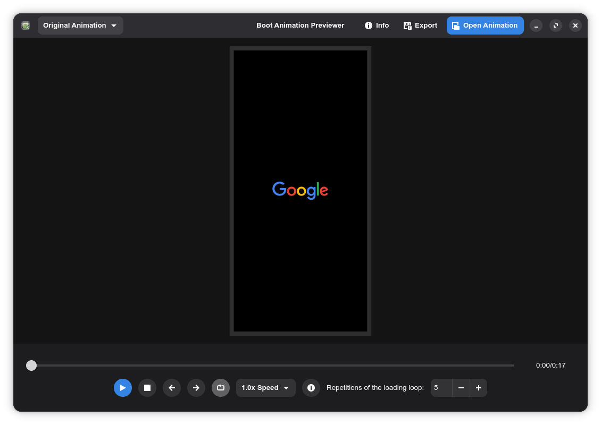

<p align="center">
  
</p>

<h1 align="center">Boot Animation Previewer</h1>

<p align="center">
  A GTK4/Libadwaita application for previewing and exporting Android bootanimation files.
  <br>
  Version <strong>1.0.0</strong>
</p>


## Features

- **Preview** boot animations at original or device-mapped resolution
- **Playback** with play/pause, stop, frame-by-frame navigation, and seekbar
- **Hold-to-repeat** on prev/next frame buttons
- **Speed control** — 0.5x, 1.0x, 1.5x, 2.0x
- **Loop** entire animation or control per-part repeat count
- **Export** to MP4 or GIF at any device preset resolution
- **Device presets** for common phone, tablet, smartwatch, and foldable resolutions
- **Custom viewport dimensions** (100–8000 px)
- **File info dialog** with About, Shortcuts, copy path, and show-in-folder
- **Player status bar** showing current part, frame, and logical position

## Dependencies

- Python 3.10+
- GTK4 / Libadwaita (via `PyGObject`)
- `pycairo`
- `opencv-python`
- `numpy`
- `ffmpeg` (required only for GIF export)

## Installation

### Arch Linux

```bash
git clone https://github.com/hexman1999/bootanimation-previewer-gtk4.git
cd bootanimation-previewer-gtk4
makepkg -si
```

### Ubuntu / Debian

```bash
git clone https://github.com/hexman1999/bootanimation-previewer-gtk4.git
cd bootanimation-previewer-gtk4
sudo apt install python3-pip libgirepository1.0-dev libcairo2-dev libgtk-4-dev libadwaita-1-dev ffmpeg
pip install -r requirements.txt
python3 previewer.py
```

### Fedora

```bash
git clone https://github.com/hexman1999/bootanimation-previewer-gtk4.git
cd bootanimation-previewer-gtk4
sudo dnf install python3-pip python3-devel cairo-devel gtk4-devel libadwaita-devel gobject-introspection-devel ffmpeg
pip install -r requirements.txt
python3 previewer.py
```

### Interactive installer (any distro)

```bash
chmod +x install.sh
./install.sh
```

Choose local (user only, no root) or global (system-wide via sudo).

### Manual

```bash
pip install -r requirements.txt
python3 previewer.py
```

## Usage

```bash
bootanimation-previewer
```

Or directly:

```bash
python3 previewer.py
```

### Interface




| Control | Location | Description |
|---------|----------|-------------|
| **Open Animation** | Header bar | Load a `bootanimation.zip` file |
| **Export** | Header bar | Export as MP4 or GIF at selected resolution |
| **Info** | Header bar | About app, shortcuts, and animation metadata |
| **Device Presets** | Header bar dropdown | Choose preview resolution preset |
| **Play/Pause** | Control bar | Toggle playback |
| **Stop** | Control bar | Stop and reset to first frame |
| **Previous / Next** | Control bar | Step through frames (hold for continuous) |
| **Loop** | Control bar | Toggle entire-animation looping |
| **Speed** | Control bar dropdown | Adjust playback speed |
| **Seekbar** | Below canvas | Drag to seek through the animation |
| **Status info** | Control bar toggle | Show/hide current part, frame, and logical position |
| **Repetitions** | Control bar spin button | Default loop count for parts with `count=0` in `desc.txt` |

### Keyboard Shortcuts

| Key | Action |
|-----|--------|
| `Ctrl+O` | Open Animation |
| `Ctrl+E` | Export |
| `I` | File Info |
| `Space` | Play / Pause |
| `S` | Stop |
| `A` / `←` | Previous Frame |
| `D` / `→` | Next Frame |
| `L` | Toggle Loop |
| `T` | Toggle Player Status |

## Input Format

Standard Android boot animation ZIP files with:

- `desc.txt` — descriptor file (format: `width height fps` header, then `type count pause path` part entries)
- Frame images — PNG or JPG per part directory
- Optional `trim.txt` per part for sub-frame trimming

## Export Output

- **MP4** — rendered via OpenCV H.264 video writer
- **GIF** — rendered through ffmpeg with palette generation and Bayer dithering

Export resolution is determined by the currently selected device preset.

## License

GPL 3.0
